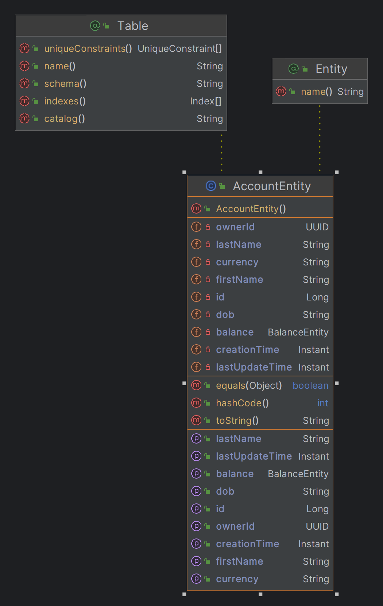
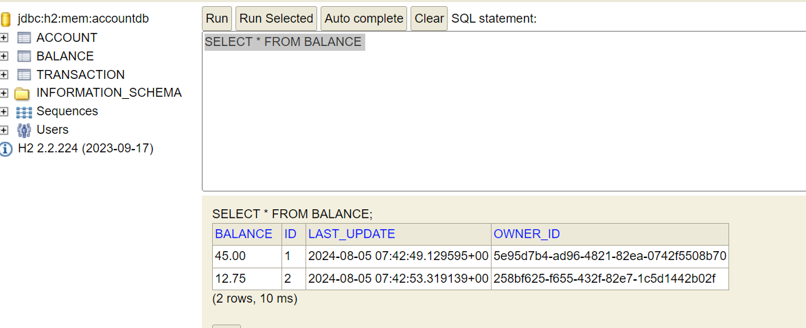

# account-transfer-ms

[!Build Status]
[!Coverage Status]

## Table of Contents

1. #### Introduction
2. #### Project Structure & flow
3. #### Installation
4. #### Configuration
5. #### How to run?
6. #### Languages and framework
7. #### Assumptions

## Introduction

This funds-transfer-ms is a one of the microservice which constitutes the Quick Transfer application.


It is a spring Boot project thats implements/part of a comprehensive Funds Transfer system with
three main controllers: AccountController, BalanceController, and TransactionController.
These controllers handle various operations related to account management, balance management,
and transaction processing. The project ensures structured flow and interaction between different layers,
including service and repository layers.

## Project Structure & flow

### Overview

##### Controller

- AccountController: Manages account creation and retrieval.
- BalanceController: Handles balance retrieval and update operations.
- TransactionController: Processes debit and credit transactions and retrieves transaction details.

##### DTO (Data Transfer Objects)
- the request and response DTOs.

##### Service
- Provides business logic and interacts with repositories to manage data operations.

##### Repository
- Manages data persistence and retrieval operations

##### Database



##### External Client

ExchangeRateClient: Communicates with the external account exchange rate service to retrieve the currency exchange rate.

##### Account creation flow

- Get Account details and Add balance to account

- Get balance


## Installation

### Prerequisites

- Java 17
- Spring-Boot 3.3.2
- Maven
- git

## Configuration Steps

1. configure the jdk - 17, in case you want to use another version, please make the necessary changes to
   java.version in parent pom.xml

2. Switch to main branch. There are a couple of feature branches starting with feature/101 too.

## How to run?

1. Clone the repo - https://github.com/Thor-TechSavy/account-ms.git
2. Validate the application properties.
3. Build using Maven wrapper,
   For WINDOWS,
    - Ensure JAVA_HOME is set properly,
    - navigate to project directory and do 'mvnw.cmd clean install'
      

   For Bash, ./mvnw clean install
   

4. OPTIONAL -You can also build using maven plugin in the IntelliJ
   
5. Start the application - using the intelliJ or via command via bash or commandLine
6. ## Swagger Information
   - Swagger UI: http://localhost:9000/swagger-ui.html
   - OpenApi Json: http://localhost:9000/v3/api-docs
7. IN MEMORY H2 DB
   - link: http://localhost:9000/h2-console/login.jsp
   - Jdbc url: jdbc:h2:accountdb
## Languages and Framework

- java 17, spring-boot, junit, jackson, slf4j, mockito

## Assumptions

1. For the debit/credit request, the transaction is created with PROCESSING status.
2. The status is change to SUCCESSFUL or FAILED.
3. Transaction works only when both the debit and the credit account exist.
4. The exchange rate is retrieved from external API. In local environment,
the mocked response (returns .85 for every currency exchange request) is obtained when the call is made to this api.
5. Use pessimistic locking to ensure data consistency in concurrent environment.
6. persists the entities in in-memory h2 db.


## Tests and output

1. How to create account?
```text

URL: POST http://localhost:9000/v1/account
PAYLOAD:
{
    "firstName": "CAPTAIN",
    "lastName": "PLANET",
    "dob": "17-10-2000",
    "currency": "EUR"
}

RESPONSE: 
{
    "ownerId": "93bba033-a7f4-4505-8e9c-5109a8d1bdfc",
    "firstName": "CAPTAIN",
    "lastName": "PLANET",
    "dob": "17-10-2000",
    "currency": "EUR"
}


```


2. how to fetch account?
```text

URL: GET http://localhost:9000/v1/account/{{ownerId}}

RESPONSE: 
{
    "ownerId": "93bba033-a7f4-4505-8e9c-5109a8d1bdfc",
    "firstName": "CAPTAIN",
    "lastName": "PLANET",
    "dob": "17-10-2000",
    "currency": "EUR"
}
```


3. How to add balance?
```text

URL: PUT http://localhost:9000/v1/account/balance/{{ownerId}}?amount={{amount}}

RESPONSE: 
{
    "ownerId": "93bba033-a7f4-4505-8e9c-5109a8d1bdfc",
    "balance": "20.0",
    "currency": "EUR",
    "lastUpdate": "2024-08-03T16:06:38.919517900Z"
}
```


4. how to fetch balance?
```text

URL: GET http://localhost:9000/v1/account/balance/{{ownerId}}

RESPONSE: 
{
    "ownerId": "93bba033-a7f4-4505-8e9c-5109a8d1bdfc",
    "balance": "20.0",
    "currency": "EUR",
    "lastUpdate": "2024-08-03T16:06:38.919517900Z"
}
```
5. how to perform transaction between two accounts
```text

URL: http://localhost:9000/v1/account/transaction

PAYLOAD:
{
  "fromOwnerId": "11111111-1111-1111-1111-000011111111",
  "toOwnerId": "11111111-1111-1111-1111-000011111111",
  "amount": 100,
  "requestIdentifier": {
    "calleeName": "ZEUS",
    "requestTime": "2024-08-03T16:06:38.919517900Z",
    "transferRequestId": "11111111-1111-1111-1111-000011111111"
  }
}

RESPONSE: 
{
  "transactionId": "3fa85f64-5717-4562-b3fc-2c963f66afa6",
  "fromOwnerId": "3fa85f64-5717-4562-b3fc-2c963f66afa6",
  "toOwnerId": "3fa85f64-5717-4562-b3fc-2c963f66afa6",
  "requestIdentifier": "string",
  "amount": 0,
  "transactionStatus": "SUCCESSFUL"
}
```


